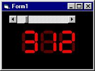



## Digital Display Code

### Description

This code displays a 3 digit display in a few lines of code. you can simply add more digits and code to the display. it is a simple subroutine. The only call will be 'Digit(value as integer)' and the number is drawn. Colors can be set in design time, but even programmed to be changed in runtime.
 
### More Info
 
it returns a real fast working old fashion display

             |
---                |---
**Submitted On**   |2002-08-10 22:56:24
**By**             |[Remco de Hundt](https://github.com/Planet-Source-Code/PSCIndex/blob/master/ByAuthor/remco-de-hundt.md)
**Level**          |Advanced
**User Rating**    |4.7 (56 globes from 12 users)
**Compatibility**  |VB 6\.0
**Category**       |[Graphics](https://github.com/Planet-Source-Code/PSCIndex/blob/master/ByCategory/graphics__1-46.md)
**World**          |[Visual Basic](https://github.com/Planet-Source-Code/PSCIndex/blob/master/ByWorld/visual-basic.md)
**Archive File**   |[Digital\_Di1167028102002\.zip](https://github.com/Planet-Source-Code/remco-de-hundt-digital-display-code__1-37814/archive/master.zip)

